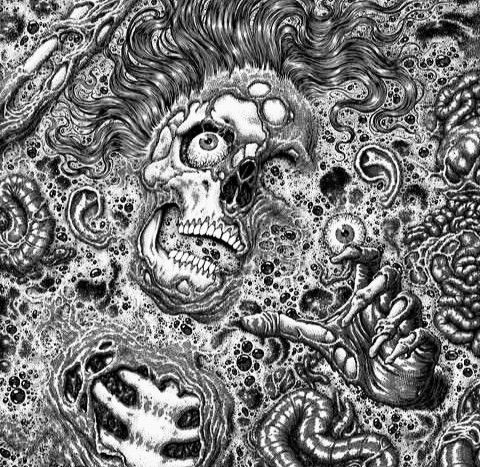

## The Hearse Song (Short Version)

Never laugh when a hearse goes by,  
or you may be the next to die.  
First they wrap you in a big white sheet,  
then they throw you six feet deep.  
It all goes well for about a week,  
then your tomb starts to leak.  
Ants run in, ants run out.  
Ants play pinochle on your spout.  
And then your corpse turns a sickening green,  
and pus runs out like whipping cream.  
So never laugh when hearse goes by,  
or you may be the next to die.

---

## The Hearse Song (Extended Version)

Don’t you ever laugh as the hearse goes by,  
For you may be the next one to die.  
They wrap you up in big white sheets  
and cover you from head to feet.  
They put you in a big black box  
And cover you with dirt and rocks.  
All goes well for about a week,  
Until your coffin begins to leak.  
The worms crawl in, the worms crawl out,  
The worms play pinochle on your snout,  
They eat your eyes, they eat your nose,  
They eat the jelly between your toes.  
A big green worm with rolling eyes  
Crawls in your stomach and out your sides.  
Your stomach turns a slimy green,  
And pus pours out like whipping cream.  
You’ll spread it on a slice of bread,  
And that’s what you eat when you are dead.
